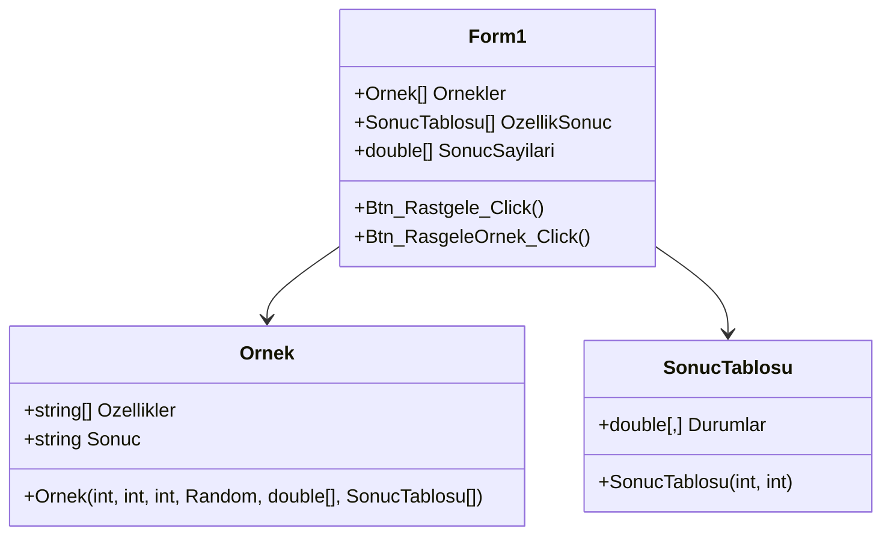

# Bayes Classifier

**Naive Bayes classifier implementation in C# WinForms. Generates random training data, computes conditional probabilities, and classifies new samples using Bayes' theorem.**

## Features

- **Random Data Generation**: Creates random training examples with configurable features, states, and outcomes
- **Probability Tables**: Computes and displays `P(feature_state | outcome)` conditional probability tables
- **Prior Probability Display**: Shows `P(outcome)` for each result class
- **Interactive Classification**: Generates random test samples and classifies them using Naive Bayes
- **Tree View**: Visual hierarchical display of all training examples

## Project Structure

```
bayes-classifier/
├── Bayes.sln
├── Bayes/
│   ├── Form1.cs              # Main form: UI, training, classification
│   ├── Form1.Designer.cs     # Designer-generated layout
│   ├── Ornek.cs              # Sample (example) class
│   ├── SonucTablosu.cs       # Result probability table
│   ├── Program.cs            # Application entry point
│   └── Properties/
│       ├── AssemblyInfo.cs
│       ├── Resources.Designer.cs
│       └── Settings.Designer.cs
└── README.md
```

## Algorithm Flow

```mermaid
flowchart TD
    A[Configure parameters] --> B[Generate random training examples]
    B --> C[Count feature-state occurrences per outcome]
    C --> D1[Compute conditional probabilities]
    D1 ~~~ D2[P(feature_state | outcome)]
    D1 --> E[Display probability tables]
    E --> F[Generate random test sample]
    F --> G[For each outcome class:]
    G --> H1[Compute P(outcome|sample) ∝]
    H1 ~~~ H2[P(outcome) × Π P(feature_i | outcome)]
    H1 --> I[Select outcome with highest probability]
    I --> J[Display classification result]
```

## Core Concepts

### Naive Bayes Theorem

The classifier applies Bayes' theorem with the "naive" assumption of conditional independence:

$$P(C_k | x) = \frac{P(C_k) \cdot \prod_{i=1}^{n} P(x_i | C_k)}{P(x)}$$

Where:
- **P(C_k | x)**: Posterior probability of class `k` given features `x`
- **P(C_k)**: Prior probability of class `k`
- **P(x_i | C_k)**: Conditional probability of feature `i` given class `k`
- **P(x)**: Evidence (normalizing constant, omitted in practice)

The predicted class is the one that maximizes the posterior:

$$\hat{y} = \arg\max_{k} P(C_k) \prod_{i=1}^{n} P(x_i | C_k)$$

### Class Structure



### Data Flow

1. **Training Phase** (`Btn_Rastgele_Click`):
   - User sets: number of examples, features, states per feature, outcomes
   - Random examples generated; each has random feature states and a random outcome
   - `SonucTablosu.Durumlar[state, outcome]` counts co-occurrences
   - Counts are normalized by `SonucSayilari[k]` (total per outcome)
   - `P(feature_state | outcome)` = count / total for that outcome
   - Priors: `P(outcome)` = count / total examples

2. **Classification Phase** (`Btn_RasgeleOrnek_Click`):
   - Random test sample generated with random feature states
   - For each outcome class:
     - Start with `P_score = 1`
     - Multiply by `P(feature_i_state | outcome)` for each feature
     - Multiply by `P(outcome)` prior
   - Outcome with highest `P_score` is the prediction

### Probability Table
The `dataGridView1` displays a matrix where:
- **Rows**: Outcome classes (Sonuc_0, Sonuc_1, ...)
- **Columns**: Grouped by feature, then state: `Durum(feat)_state`

Each cell shows `P(feature_state | outcome)`.

## How to Use

1. Run the application
2. Configure: number of examples, features, states per feature, outcomes
3. Click **"Rastgele Örnekler Oluştur"** (Generate Random Examples)
4. View probability tables and example tree
5. Click **"Rastgele Örnek Sınıflandır"** (Classify Random Sample)
6. See which outcome class the sample was assigned to

## Building

Open `Bayes.sln` in Visual Studio 2008+ (retarget .NET Framework if needed) and build.
